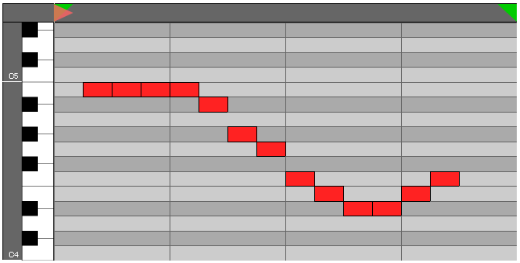
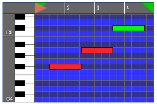

# webaudio-pianoroll
Pianoroll GUI library for Web application / relevant to webaudio-controls

`webaudio-pianoroll` is a GUI library for pianoroll.
Using webaudio-pianoroll with webaudio-controls makes it easy to build webaudio application.

`webaudio-controls` is here :  
[webaudio-controls](https://github.com/g200kg/webaudio-controls)

* Editmode - `webaudio-pianoroll` has four edit mode, `gridmono`, `gridpoly`, `dragmono` and `dragpoly`. `grid` types are just toggle the grid cell by clicking, and the note length is always 1 tick. `grid` types matche to rhythm machine like app. The other hand, `drag` types can specify note length by dragging. that are matches generic pianoroll apps.
* Many customize options.
* Play support - `webaudio-pianoroll` has not direct sound generation function, but has play support function.

Live Demo page is available.  
### [Live Demo : 'gridmono' mode](https://g200kg.github.io/webaudio-pianoroll/)
###  [Live Demo : 'dragpoly' timebase=480 mode](https://g200kg.github.io/webaudio-pianoroll/index3.html)  

----
## Usage

### The previous version was a module of Polymer, but now it is a normal JavaScript library using WebCompnents API.

### Since webaudio-pianoroll uses only the functionality of WebComponents CustomElements, it works without webcomponents polyfill in Chrome and Firefox.

* #### Install webaudio-pianoroll  

  If you know **bower**, use the command `> bower install g200kg/webaudio-pianoroll`.  
  This command prepares webaudio-pianoroll under your current folder.  
  Otherwise,  download zipped file and deploy appropriately. necessary file is `webaudio-pianoroll.js`.   
    
  And load the `webaudio-pianoroll.js` :  
  ``
  
  Or, just directory load from GitHub pages as CDN.  
  ``

* #### If needed, load webcomponents.js in your HTML.  
``  

* #### place webaudio-pianoroll element in your HTML
 `<webaudio-pianoroll></webaudio-pianoroll>`  

 In default, it makes element like this:  
  

  Then you can customize the pianoroll with attributes. For example,  
 `<webaudio-pianoroll width="300" height="200" xrange="64" markend="64" collt="#33f" coldk="#338" editmode="dragmono"></webaudio-pianoroll>
`  

   

## How To Operate

#### Common
* Time axis can be zoomed by mouse wheel if enabled by a "wheelzoom" attribute.

#### Grid Mode
* The cell can be toggle on/off by clicking.
* When dragging, you can turn on or off multiple cells depending on the state of the first cell.

#### Drag mode
* Drag with the left button to create a specified length note.
* Click existing note to select.
* Drag with the right button to select notes within the specified area (Whether the note is included in the range or not is determined based on whether or not the beginning of the note is included).
* Selected notes can be moved by left button dragging.
* Drag the left or right edge of the selected note to change the length of the note.
* Right click on the selected note to delete menu.

## Attributes

|Attribute     |Options|Default   |Description               |
|--------------|-------|----------|--------------------------|
|**width**     |Number |640       | width of element in px   |
|**height**    |Number |320       | height of element in px  |
|**editmode**  |String |"gridmono"| combination of "grid"/"drag" + "mono"/"poly"|
|**timebase**  |Number |16        | time resolution of 1 bar,  (1 bar / timebase = 1 tick)  |
|**xrange**    |Number |16        | time axis view range in tick|
|**yrange**    |Number |16        | y axis view range in note number|
|**xoffset**   |Number |0         | time axis offset in tick|
|**yoffset**   |Number |60        | y axis offset in note number|
|**grid**      |Number |4         | time axis grid density in tick|
|**snap**      |Number |1         | note x position snapping in tick|
|**wheelzoom** |Number |0         | if non 0, time axis zoom by wheel is enabled|
|**xruler**    |Number |24        | time axis ruler height in px|
|**yruler**    |Number |24        | y axis ruler width in px|
|**octadj**    |Number |-1        | ruler octave value adjust  (-1 : 60=C4)|
|**cursor**    |Number |0         |current play position in tick|
|**markstart** |Number |0         | play range start marker position in tick|
|**markend**   |Number |16        | play range end marker position in tick|
|**collt**     |String |"#ccc"    | score background (light part) color|
|**coldk**     |String |"#aaa"    | score background (dark part) color|
|**colgrid**   |String |"#666"    | score grid color|
|**colnote**   |String |"#f22"    | note color |
|**colnotesel**|String |"#0f0"    | selected note color (for editmode="drag")|
|**colnoteborder**|String|"#000" | note border color|
|**colrulerbg**|String |"#666"    | ruler background color|
|**colrulerfg**|String |"#fff"    | ruler foreground color|
|**colrulerborder**|String|"#000"| ruler border color|
|**bgsrc**     |String|null| background image url. To make visible this, you should set collt/coldk non-opaque with 'rgba(r,g,b,a)' style. |
|**cursorsrc** |String | internal resource| playcursor image url|
|**cursoroffset**|Number|0|playcursor image x offset in px|
|**markstartsrc**|String|internal resource| markstart image url|
|**markstartoffset**|Number|0| markstart image x offset in px|
|**markendsrc**|String|internal resource| markend image url|
|**markendoffset**|Number|-24| markend image  x offset in px|
|**kbsrc**     |String|internal resource| keyboard image url|
|**kbwidth**   |Number|40|keyboard image width in px|
|**loop**      |Number |1         | loop play|
|**preload**   |Number |1| data preload when play in sec|
|**tempo**     |Number|120|tempo when play|

## Functions

|Function|Description|
|--------|-----------|
|**redraw()**| redraw all|
|**getMMLString()**| get MML string of current data.  Note that this function is for `mono` type editmode.|
|**setMMLString(str)**| set MML string to webaudio-pianoroll.  Note that this function is for `mono` type editmode.|
|**locate(tick)**| set cursor to specified tick|
|**play(audioContext, callback, starttick)**|play current data. `webaudio-pianoroll` does not generate sound directly, but it passes necessary information to the specified callback function. `audioContext` is used to control the time axis. If `starttick` is not specified, play from current cursor position.|

## Callback
play() function passes necessary data for playing to callback function like :
`callback({t:noteOnTime, g:noteOffTime, n:noteNumber})`

Here the noteOnTime and noteOffTime is audioContext timeline value.

## DataStructure
If you want to access directly to sequence data, you can touch the `DOMElement.sequence`.

`DOMElement.sequence` is an Array of noteEvents. Here the noteEvent is a object of one note infomation of:  
`{t:noteOnTick g:noteLength n:noteNumber}`

## License
`webaudio-pianoroll` is licensed under the Apache License, Version 2.0
